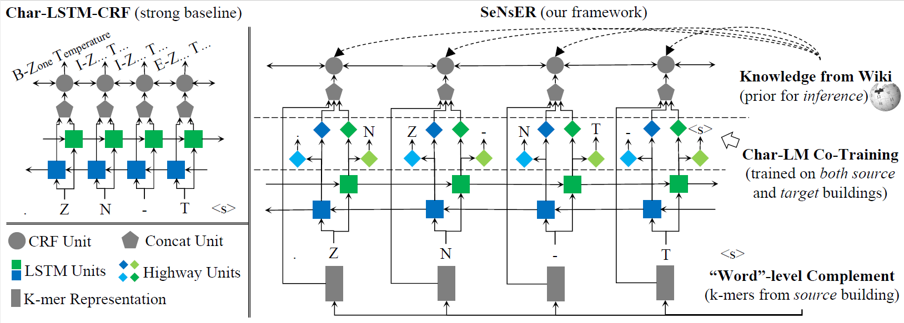

# SeNsER

## Quick Links

- [SeNsER](#senser)
  - [Quick Links](#quick-links)
  - [Model Notes](#model-notes)
  - [Installation](#installation)
    - [Dependencies](#dependencies)
  - [Data](#data)
    - [Task](#task)
    - [Format](#format)
  - [Embedding](#embedding)
  - [Training](#training)
  - [Evaluation](#evaluation)
  - [Contact](#contact)


## Model Notes

<p align="center"></p>

SeNsER learns a sensor metadata tagger for a new building based on its raw metadata and some existing fully annotated building. It leverages the commonality between different buildings: At the character level, it employs bidirectional
neural language models to capture the shared underlying patterns between two buildings and thus regularizes the feature learning process; At the word level, it leverages as features the k-mers existing in the fully annotated building.
During inference, we further incorporate the information obtained from sources such as Wikipedia as prior knowledge.
## Installation


### Dependencies

The code is written in Python 3.6.
```
pip3 install -r requirements.txt

cd Model/PythonUtils/StringMatch & python setup.py install 
```

## Data

We mainly focus on data from building apm and ebu3b.

### Task

```
Chunking:

"Data/apm-ebu3b-chunk": train and dev on apm ,test on ebu3b

"Data/ebu3b-apm-chunk": train and dev on ebu3b, test on apm
```

```
Tagging:

"Data/apm-ebu3b-tag": train and dev on apm ,test on ebu3b

"Data/ebu3b-apm-tag": train and dev on ebu3b, test on apm
```

### Format

**Character** **Label** 

**Empty lines** are used as separators between sequences.


```
a B-
p I-
& I-
m I-
. O-
r B-
m I-
- I-
4 I-
7 I-
3 I-
1 I-
. O-
d B-
m I-
p I-
r I-
- O-
p B-
o I-
s I-
```

## Embedding

Words in building domain are special. We must train the specific embedding with raw data before we do the following NER model training. Raw data of two buildings is in "Embedding/sentences". You can use "Embedding/word2vec.py" for embedding training.

## Training
**SeNsER (train on ebu3b, test on apm)**

```bash
python train_wc.py
```

**SeNsER-Kmer (train on ebu3b, test on apm)**

```bash
python train_wc.py --no_dict
```

**SeNsER-Dict (train on ebu3b, test on apm)**

```bash
python train_wc.py --word_emb_weight 0
```

## Evaluation
Evaluation will generate the output of model to 'Model/model_output.txt'.

```bash
python eval_wc.py
```

## Contact
If you have any questions, please contact Jiacheng Li (j9li@eng.ucsd.edu)